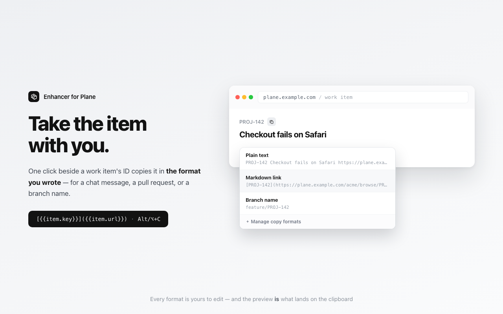

# Enhancer for Plane — 프로젝트·위키·이슈

[English](README.md) · **한국어**

[](https://chromewebstore.google.com/detail/dicjfphghjfljkifogkplgdeefjdkhbo)

**➜ [Chrome 웹 스토어에서 설치](https://chromewebstore.google.com/detail/dicjfphghjfljkifogkplgdeefjdkhbo)** — 또는 [소스에서 직접 로드](#설치).

[Plane](https://github.com/makeplane/plane)(makeplane / plane.so) — 오픈소스
**프로젝트 관리·이슈·위키** 도구이자 Jira의 자체 호스팅 대안 — 을 위한 가벼운
비공식 크롬 익스텐션(Manifest V3)입니다. **Plane 서버를 전혀 수정하지 않고**,
사용자가 지정한 도메인에서만 화면의 사소한 불편을 바로잡아 줍니다.

> Plane과 제휴하거나 승인받은 제품이 아닙니다. "Plane"은 해당 소유자의 상표이며,
> 본 익스텐션은 독립적인 비공식 애드온입니다. (비행기와는 무관합니다.)

브랜드: Plane의 모노크롬 톤(니어블랙 `#121212` + 화이트)을 따릅니다.


## 기능

1. **본문 템플릿(제목 + 본문)** — 재사용 템플릿을 등록해 한 번의 클릭으로 삽입.
   스톡 Plane 대비 가장 큰 강점입니다.
   - 설명 툴바의 **"Attach" 바로 옆에 네이티브 "Template" 버튼**을 추가(행 마지막,
     버튼 간 간격 동일, 문서 아이콘).
   - **"신규 작업항목 생성" 모달에서도 동작**합니다 — 이 에디터는 툴바가 없어 모달
     헤더의 프로젝트 선택기 옆에 "Template" 버튼이 뜹니다(제목+본문을 함께 채우는 항목
     수준 위치). `Alt/⌥+T`는 양쪽 모두에서 작동합니다.
   - 선택 시 **작업 항목 제목**(상세 뷰는 `#title-input`, 모달은 `#name` 입력)과
     **본문**(ProseMirror)을 함께 채웁니다. 제목은 선택 사항.
   - 템플릿 본문은 **마크다운으로 작성되어 에디터에 리치로 렌더**됩니다 — `##` 제목,
     `-`/`1.` 목록, `- [ ]` 체크박스, `**굵게**`, `` `코드` ``. Plane 에디터가
     WYSIWYG(TipTap/ProseMirror)이므로, 마크다운을 HTML로 변환해 합성 paste 이벤트로
     넣어 실제 노드로 렌더합니다. 에디터가 받지 않으면 리터럴 텍스트로 안전하게
     대체됩니다.
   - Plane이 툴바를 다시 그려도 `MutationObserver`(+ 초기 부트스트랩 폴링)로 버튼을
     재삽입합니다. 버튼은 Attach를 복제해 항상 네이티브하게 보입니다. (댓글 템플릿은
     제공하지 않습니다.)
2. **템플릿 변수** — 삽입 시 자동 치환: `{{date}}`(오늘, `YYYY-MM-DD`),
   `{{date+N}}`/`{{date-N}}`(오늘 기준 N일 뒤/앞, 예: 마감일 `{{date+7}}`),
   `{{week}}`(이번 주 범위 `YYYY-MM-DD ~ YYYY-MM-DD`, 월~일), `{{month}}`(`YYYY-MM`).
   설명 편집 중 `Alt/⌥+T`로 템플릿 메뉴를 엽니다.
   macOS에서 Option+T는 `e.key`가 특수문자로 바뀌므로
   레이아웃 무관한 `e.code === "KeyT"`로 감지합니다.
   - **직접 만드는 변수(최대 5개)** — 설정에서 `이름` → `값` 쌍을 등록하고 템플릿에서
     `{{var.이름}}`으로 씁니다(예: `{{var.team}}` → `Platform`). `var.` 접두어가 내장
     변수와의 충돌을 구조적으로 막습니다 — 나중에 `{{quarter}}`가 내장으로 추가돼도
     기존 `{{var.quarter}}`는 그대로 동작합니다. 등록하지 않은 이름은 지우지 않고
     그대로 두므로, 오타가 조용히 텍스트를 삼키지 않고 눈에 보입니다. 동기화와 함께
     쓸 때 진가가 나옵니다 — 공유 템플릿에 `{{var.team}}`을 넣어두면 삽입하는 사람마다
     다른 값으로 채워지고, 개인 값은 브라우저 밖으로 나가지 않습니다.
3. **참조 복사** — 작업 항목 화면에서 번호 옆 버튼(또는 `Alt/⌥+C`)을 누르면 그 항목을
   클립보드로 복사합니다. 메신저, 풀 리퀘스트 본문, 브랜치명으로 넘길 때 제목 드래그와
   URL 복사를 따로 하지 않아도 됩니다.
   - **형식은 직접 씁니다.** 일반 텍스트 / 마크다운 링크 / 브랜치명 세 가지가 기본으로
     들어 있지만 전부 편집 가능한 평범한 줄입니다. 형식은 적은 그대로 복사되며,
     마크다운 형식이 `[…](…)`를 직접 담고 있는 것도 그래서입니다 — 편집하는 것과 나오는
     것이 같아야 합니다. 설정 화면에서 줄마다 결과를 미리 보여 줍니다.
   - 치환되는 값은 `{{item.key}}`, `{{item.title}}`, `{{item.url}}` 세 가지입니다.
     브랜치명용 "제목 슬러그"는 **일부러 넣지 않았습니다** — 한글이나 이모지 제목은
     빈 문자열이 되어 버리고, 절반만 되는 기능은 없는 것만 못합니다.
   - 페이지에서 읽지 못한 값은 빈 문자열이 되지 않고 **토큰 그대로 남으며**, 토스트가
     어떤 값인지 알려 줍니다. 붙여넣기 전에 알 수 있습니다.
   - 항목 자신의 화면과 **목록에서 열리는 패널** 양쪽에서 동작합니다(헤더 구조가 같습니다).
     항목 화면에서는 주소창을 그대로 씁니다. 패널은 *목록의* URL을 유지하고 항목으로 가는
     링크를 하나도 담고 있지 않아서, 거기서는 `/{워크스페이스}/browse/{번호}` 형태로
     조립합니다 — Plane의 정식 짧은 링크이며 `/projects/{uuid}/issues/{uuid}`가 이 주소로
     리다이렉트하는 것을 확인했습니다. 이 조립이 나중에 Plane이 바뀌면 조용히 깨질 수 있는
     유일한 지점이라 소스에 그렇게 주석으로 적어 두었습니다.



4. **스타일 규칙(폭/길이) — 범용 엔진**
   - `선택자 + 속성 + 값` 규칙을 자유롭게 추가/수정/삭제. 각 규칙은
     `선택자 { 속성: 값 !important; }`로 주입됩니다.
   - 단위까지 직접 입력(예: `320px`, `30rem`, `55ch`). 선택자 유효성은 실시간 검사.
   - 기본 제공 규칙: 모듈/아이템 이름 폭 `.max-w-40` → 320px. "빠른 추가" 칩으로
     두 가지를 한 번에 더 넣을 수 있습니다 — 모듈 검색 드롭다운, 그리고
     사이클/브레드크럼 이름 폭(`.max-w-[150px].truncate` → 320px).
   - 절단은 모듈만의 문제가 아닙니다. Plane은 **모듈·사이클·라벨·브레드크럼(상단
     경로)** 전반에 동일한 Tailwind "max-width + `truncate`" 패턴을 폭 값만 달리해
     (`max-w-40`/`max-w-48`/`max-w-[150px]`) 재사용합니다. 범용 엔진이므로 어느
     것이든 같은 방식으로 넓힐 수 있습니다 — 규칙을 추가하거나, 피커로 클릭하면
     `max-w-[150px]` 같은 대괄호 클래스도 자동으로 이스케이프해 줍니다. 버전에 따라
     클래스명이 바뀌면 선택자만 고치면 됩니다.
5. **비주얼 요소 피커** — 팝업의 **"🎯 Pick element → add rule"**을 누르고 Plane
   화면의 요소를 클릭하면, 각 선택자가 몇 개와 매칭되는지 개수와 함께 **후보 목록**
   (개별 클래스·전체·id, 폭 관련 클래스 우선)이 뜹니다. 고른 규칙이 설정에 추가되고
   (값은 비운 채 → 설정에서 값 입력 후 적용), DevTools 없이 폭/스타일 규칙을 만들 수
   있습니다.
   - 피커가 규칙을 추가하면 열려 있는 설정 페이지에 자동 반영됩니다
     (`chrome.storage.onChanged`, 미저장 편집이 없을 때).
6. **팀 템플릿 동기화** — JSON 파일 하나를 두면(사내 서버, Git 호스트, 아무 URL이나)
   팀 전체가 같은 템플릿을 씁니다. 기본은 꺼져 있습니다.
   - 설정에서 소스를 추가하면 Chrome이 그 오리진 하나에 대한 접근을 묻고, 템플릿이
     피커에 해당 소스 헤더 아래로 나타납니다.
   - **선택한 주기로 갱신**(1시간 / 6시간 / 12시간 / 하루마다, `chrome.alarms` 사용)하고,
     **Sync now**로 즉시 받을 수도 있습니다. 소스는 **최대 10개**이며 각각 주기와
     켜기/끄기를 따로 가집니다.
   - **동기화된 템플릿은 읽기 전용입니다.** 수정은 원본 파일에서 합니다. 대신 화면에서
     **그룹 단위로 숨기기**는 소스별로 가능하고, 이 설정은 파일을 건드리지 않은 채
     다음 동기화 후에도 유지됩니다.
   - **피커는 캐시만 읽고 네트워크를 쓰지 않습니다.** 템플릿 삽입에 요청이 발생하지
     않아 오프라인에서도 동작하며, 동기화가 실패해도 마지막 정상본이 남습니다.
   - **원격 데이터는 신뢰하지 않고 다룹니다** — 크기를 제한하고, 마크업이 아닌
     텍스트로만 그리며, id에 소스별 접두어를 붙여 개인 템플릿과 충돌하지 않게 합니다.
   - [파일 형식](#팀-템플릿-파일-형식)과 `examples/`를 참고하세요.
7. **활성 도메인** — 지정한 도메인에서만 동작. 와일드카드(`*.example.com`)와
   "모든 사이트에서 동작" 스위치 지원.
8. **백업(가져오기/내보내기)** — "Backup"에서 설정을 JSON으로 내보내고 되돌립니다.
   직접 설정한 것은 모두 담깁니다 — 도메인·규칙·템플릿·변수·복사 형식, 그리고 동기화 소스(URL,
   주기, 숨긴 그룹). 반대로 내려받은 템플릿과 동기화 상태는 담지 않습니다. 그쪽은
   다음 동기화가 다시 받아오는 기기별 캐시라서, 백업은 남의 파일의 스냅샷이 아니라
   내 설정의 백업으로 남습니다. 가져오면 폼에 로드되며 `Save`로 적용합니다.

## 팀 템플릿 파일 형식

팀이 `http(s)`로 접근할 수 있는 곳이면 어디든 JSON 파일 하나를 두면 됩니다 — 사내 경로,
Git 호스트의 raw URL, S3 버킷. 그 URL을 설정 ▸ Team template sync에 추가합니다.

이 파일을 손으로 쓸 필요는 없습니다. **설정 ▸ 본문 템플릿 ▸ "팀에 공유"** 를 누르면
지금 가진 템플릿이 아래 형식 그대로 저장됩니다. UI에서 만들고, 저장하고, 올리고,
주소를 공유하면 끝입니다. 저장할 때 모음 이름(`name`)을 묻고 오늘 날짜를 `version`으로
찍습니다. 이것은 백업이 아니라 **배포용 파일**입니다. 내 템플릿만 담기며 도메인·규칙·변수
값·소스 URL은 들어가지 않습니다. 소스에서 *받은* 템플릿도 빠집니다. 그 템플릿은 배포한
쪽에서 관리합니다.

```json
{
  "schema": 1,
  "name": "QA & Delivery standards",
  "version": "2026-07-15b",
  "templates": [
    {
      "id": "bug-detailed",
      "group": "QA Templates",
      "name": "🐞 Bug (detailed)",
      "title": "[Bug] ",
      "content": "## 재현 절차\n1. \n\n## 기대 결과\n\n## 실제 결과\n"
    }
  ]
}
```

| 필드 | 필수 | 의미 |
|---|---|---|
| `name` | 아니요 | 모음의 이름. 설정에서 소스에 직접 이름을 붙이지 않았다면 피커의 헤더로 쓰입니다. |
| `version` | 아니요 | 자유 형식 문자열. 참고용일 뿐입니다 — 아래 설명 참고. |
| `templates[]` | **예** | 중첩이 없는 단순한 배열. `{ "groups": [...] }` 형태는 지원하지 않습니다. 그룹은 항목마다 필드로 넣습니다. |
| `.name` | 예¹ | 피커에 표시되는 이름. |
| `.title` | 아니요 | 미리 채울 작업 항목 제목. |
| `.content` | 아니요 | 본문(마크다운). `{{date}}`, `{{var.team}}` 등은 삽입 시점에 치환됩니다. |
| `.group` | 아니요 | 소스 안의 하위 제목. 비우면(또는 `""`) 소스 헤더 바로 아래, 이름 있는 그룹들보다 위에 놓입니다. |
| `.id` | 아니요 | 고정 id. 생략하면 내용에서 자동 생성되는데, 그러면 항목을 수정할 때마다 "새 항목"이 되어 누군가 걸어둔 그룹 숨김 설정이 풀립니다. 오래 쓸 항목에는 id를 지정하세요. |

¹ `name`/`title`/`content` 중 최소 하나는 채워야 하며, 셋 다 비면 버려집니다.
`name`이 없는 항목은 `(untitled)`로 표시됩니다.

**`version`은 최신 여부를 판정하지 않습니다.** 익스텐션은 받아온 내용을 매번 그대로
저장합니다. 의도한 설계입니다 — 버전으로 캐시를 거르면 누군가 버전 올리기를 한 번만
잊어도 팀 전체가 옛 템플릿을 받게 되고, 이 프로젝트가 실제로 그 버그를
겪었습니다(`count: 11 / stored: 3`). 그래서 그 비교를 걷어냈습니다.

내려받을 때 적용되는 제한: 소스 **10개**, 소스당 템플릿 **200개**, 응답 **512 KB**,
본문 **20,000자**, 이름/제목/그룹 **300자**. 제한을 넘으면 그 부분만 잘리거나 빠지고
파일 전체가 거부되지는 않습니다 — 항목 하나가 크다고 나머지를 잃지 않습니다.
(소스가 디스크를 차지하는 양은 응답 캡이 정하므로, 10 × 512 KB가 저장 예산입니다 —
`chrome.storage.local` 용량의 절반입니다.)

**소스가 리다이렉트한다면 최종 주소를 넣으세요.** 리다이렉트는 따라가지만 템플릿은
승인한 오리진에서만 받습니다. 그래서 다른 호스트로 넘어가는 주소는 동기화되지 않고
`Redirected to <호스트>, which you have not granted`로 알려줍니다. 흔한 경우가 Git
호스트입니다 — `github.com/<org>/<repo>/raw/main/t.json`은 `raw.githubusercontent.com`
으로 넘어가므로, 처음부터 `raw.githubusercontent.com` 주소를 넣으면 됩니다.

그룹 순서는 파일에 처음 나온 순서를 따르고, 그룹 없는 항목이 먼저 옵니다. 실제 예시는
[`examples/team-templates.json`](examples/team-templates.json)과
[`examples/team-templates-design.json`](examples/team-templates-design.json)에 있습니다.

## 자체 호스팅 Plane 전용

이 익스텐션은 **자체 호스팅 Plane**을 위한 것입니다. **기본 활성 도메인도, 호스트
접근 권한도 없어**, 본인 인스턴스(예: `plane.your-company.com`)를 팝업의 **Enable on
this site** 또는 설정의 활성 도메인에서 추가하기 전까지는 아무 동작도 하지 않습니다
(도메인 추가 시 Chrome이 그 사이트 하나에 대한 1회성 접근 권한을 묻습니다). 그 외 사이트에서는
완전히 비활성 상태로 남습니다.

## 설치

**Chrome 웹 스토어에서 설치(권장)**

[Enhancer for Plane 설치](https://chromewebstore.google.com/detail/dicjfphghjfljkifogkplgdeefjdkhbo) →
툴바 아이콘 클릭 후 사용하는 Plane 인스턴스에서 **Enable on this site**.

**개발자 모드(소스에서)**

1. Chrome에서 `chrome://extensions` 접속.
2. 우측 상단 **개발자 모드** 켜기.
3. **압축해제된 확장 프로그램을 로드** → 이 프로젝트 폴더 선택.
4. 툴바 아이콘 클릭 → **Settings · Manage templates**에서 도메인/폭/템플릿 조정.

## 사용법 요약

- **템플릿 삽입**: 작업 항목 설명에서 **"Template" 버튼** 또는 `Alt/⌥+T` → 템플릿
  선택 → 제목·본문 자동 채움(마크다운 렌더).
- **폭 조정**: 설정 → Style rules에서 규칙 추가(또는 피커로 요소 지정) → 값 입력 →
  Save. 지정 도메인 새로고침 시 적용.
- **버튼이 안 보일 때**: 설명 에디터를 클릭하면 자동 재주입되고, 안 되면 팝업의
  **↻ Re-scan this page**로 강제 재주입합니다.
- **팀 템플릿 공유**: 설정 → Team template sync를 켜고 JSON 파일 URL을 추가(Chrome이
  그 사이트 접근을 물으면 허용) → **Sync now**. 이후 선택한 주기로 자동 갱신됩니다.

## 제약조건

- **Chrome / Chromium, Manifest V3** — Firefox·Safari용 아님.
- **자체 호스팅 Plane 전용, 기본 비활성** — 활성 도메인이 기본으로 없으며, 팝업이나
  설정에서 직접 추가해야 합니다. Plane 외 사이트는 건드리지 않습니다.
- **동기화 저장소 한계(전체 ~100 KB, 항목당 ~8 KB).** 둘 다 Chrome이 정한 값이고 올릴 수
  없습니다. 예전에는 설정 전체가 항목 하나였기 때문에 8 KB가 곧 전체 한도였고, 지금은
  템플릿이 별도 항목(`peTpl.0`, `peTpl.1`, …)에 나뉘어 담기므로 한도가 전체 100 KB입니다.

  용량은 글자 수가 아니라 **바이트**로 셉니다. 한글은 글자당 3바이트, 이모지는 4바이트,
  `<`는 Chrome이 이스케이프해서 저장하므로 6바이트입니다. 그래서 정직한 답은 하나의
  숫자가 아니라 범위이며, 아래는 추정이 아니라 실측값입니다.

  | | 100 KB에 들어가는 개수 | 템플릿 1개 최대 길이 |
  |---|---|---|
  | 영문 400자 | 약 218개 | 약 8,100자 |
  | 한글 400자 | 약 81개 | 약 2,700자 |
  | HTML 섞인 마크다운 | 약 160개 | 약 1,350자 |

  **템플릿 하나는 여전히 8 KB 항목 하나에 들어가야 합니다** — 더 쪼갤 수 없습니다. 두
  한도 중 어느 쪽이든 넘기면 저장은 미리 거부되며, 어느 템플릿 또는 어느 설정이 원인인지
  알려줍니다. 설정 페이지 미터는 두 한도를 모두 봅니다. **팀 템플릿은 이 한도를 전혀 쓰지
  않습니다** — `chrome.storage.local`(10 MB, Chrome 113 이하는 5 MB, 이 기기 전용)에
  저장되며, 공유 템플릿을 많이 두려면 동기화가 답인 이유가 이것입니다.
- **동기화된 템플릿은 읽기 전용.** 수정은 설정이 아니라 원본 파일에서 합니다. 여기서
  고쳐봐야 다음 동기화가 조용히 되돌리므로 아예 수정 수단을 두지 않았습니다. 그룹
  숨기기는 로컬 설정이라 유지됩니다.
- **마크다운 렌더링은 에디터에 의존** — 본문을 HTML로 paste해 제목/목록/체크박스를
  렌더하며, 특정 빌드가 paste를 거부하면 리터럴 텍스트로 대체됩니다.
- **설명 템플릿만 지원** — 댓글 템플릿은 제공하지 않습니다.
- **규칙 값은 sanitize** — 값에서 `;{}` 제거, 속성명은 화이트리스트, 선택자는 파싱
  검증 후 주입.

## 권한

- `storage` — 사용자 설정(도메인·규칙·템플릿·변수·복사 형식·동기화 소스)을 저장하고, 내려받은
  팀 템플릿을 이 기기에 캐시합니다.
- `alarms` — 선택한 주기에 서비스 워커를 깨워 팀 템플릿을 갱신합니다. MV3 워커는 유휴
  상태에서 종료되므로 `setTimeout`은 아예 실행되지 않습니다. 주기 동기화를 하려면 이
  방법뿐입니다. 설치 시 Chrome이 이 권한으로 경고를 띄우지 않습니다.
- `activeTab` — 툴바 아이콘 클릭 시, 팝업이 현재 탭의 호스트명을 읽어 상태 표시 및
  "Enable on this site"를 제공하고, 요소 피커 시작 메시지를 현재 탭에 보냅니다. 사용자가
  익스텐션을 실행한 그 탭에 한정됩니다.
- `scripting` — 사용자가 승인한 특정 오리진에만 콘텐츠 스크립트를 등록/주입합니다.
- **선택적 호스트 권한, 사이트별 요청.** 설치 시 **호스트 접근 권한이 전혀 없습니다.**
  도메인을 활성화할 때(팝업 또는 설정) 그 **오리진 하나만** 접근을 요청하고, Chrome이
  사이트명을 명시한 권한 프롬프트를 띄웁니다. 모든 사이트 접근을 미리 요구하지 않으며,
  승인한 도메인에 대해서만 접근을 보유하고, 도메인을 제거하면 접근도 해제됩니다. (자체
  호스팅 Plane 호스트는 빌드 시점에 알 수 없어 고정 목록이 불가능하므로, 이 사이트별
  승인이 임의 호스트를 지원하는 최소 권한 방식입니다.) 팀 템플릿 소스 URL도 같은 방식으로
  승인받습니다 — 소스를 추가할 때 해당 오리진을 묻고, 승인하지 않은 오리진은 워커가
  요청 자체를 거부합니다.

계정·추적·분석·원격 코드가 없습니다. 개발자는 서버를 운영하지 않으며 사용자로부터
아무것도 받지 않습니다. 익스텐션이 보내는 유일한 요청은 사용자가 직접 등록한 URL에서
팀 템플릿 파일을 내려받는 것이고, 그 요청에는 사용자의 데이터가 담기지 않습니다.
자세한 내용은 [PRIVACY.md](PRIVACY.md) 참고.

## 동작 방식 메모

- **승인 전에는 호스트 접근이 없습니다.** 정적 콘텐츠 스크립트가 없습니다. 도메인을
  활성화하면 그 오리진에 접근을 요청하고, 서비스 워커가 `chrome.scripting`으로 해당
  오리진에 콘텐츠 스크립트·CSS를 등록합니다(이미 열린 탭엔 즉시 주입해 새로고침 불필요).
  등록은 재시작에도 유지되며 권한·설정 변경 시마다 재조정되고, 도메인을 제거하면 접근도
  해제됩니다.
- **동기화는 워커와 캐시 구조입니다. 실시간 요청이 아닙니다.** `chrome.alarms`가 서비스
  워커를 깨우면(MV3 워커는 유휴 시 종료되므로 타이머는 실행되지 않습니다) 주기가 된
  소스만 받아와 검증·제한을 거쳐 `chrome.storage.local`에 씁니다. 피커·팝업·설정은
  모두 이 캐시만 읽습니다. 그래서 템플릿 삽입에 요청이 없고 오프라인에서도 동작하며,
  소스가 죽었거나 형식이 깨져도 마지막 정상본이 그대로 남고 오류는 설정에 표시됩니다.
  소스를 지우면 캐시된 템플릿도 즉시 사라집니다.
- **스타일은 `adoptedStyleSheets`로 주입**합니다. Plane은 Next.js/React SPA라
  `<head>`/`<body>`에 `<style>` 노드를 넣으면 hydration 과정에서 제거될 수 있어,
  DOM 트리에 잡히지 않는 `adoptedStyleSheets`를 사용합니다.
- **언어 독립 앵커.** 템플릿 버튼·제목 채우기는 UI 텍스트에 의존하지 않습니다. 툴바
  앵커는 구조적으로 찾고(Attach 버튼이 숨은 `input[type="file"]`을 감쌈 — 모든 언어에서
  동일), 제목은 안정적인 `#title-input` id로 매칭합니다. 따라서 어떤 UI 언어의
  Plane에서도 동작하며, `attach`/`첨부` 텍스트는 fallback으로만 둡니다.
- **자가 복구 주입.** 툴바가 늦게 마운트돼 버튼이 안 보여도 새로고침 없이 복구됩니다 —
  설명 에디터에 포커스(또는 `Alt/⌥+T`) 시 재스캔, 팝업의 **↻ Re-scan this page**로 강제
  재주입. 콘텐츠 스크립트가 아예 로드되지 않았으면(이 도메인을 활성화하기 전부터 열린 탭 등)
  Re-scan이 이를 알려 새로고침을 안내합니다.

## 검증

의존성도 빌드 단계도 없습니다. 기본 node로 실행합니다:

```sh
node tools/test.js          # 동작: 동기화 엔진, 정규화, 섹션 구성, 개수
node tools/check-i18n.js    # 번역 계약(CI에서는 --strict)
node tools/check-source.js  # 아키텍처 불변식
```

CI가 모든 푸시와 PR에서 셋 다 돌립니다. `check-source.js`는 리뷰어가 기억해야 했을
규칙을 대신 강제합니다 — 네트워크는 워커 안에서만, 우리가 쓰지 않은 데이터는
`innerHTML`에 넣지 않기, 원격 필드는 전부 제한 적용, 그리고 릴리스 zip에 실제 로드되는
파일이 빠지지 않았는지. 기여 규칙은 [AGENTS.md](AGENTS.md)에 있습니다.

## 배포

스토어 등록 문구(영/한), 권한 정당화, 자산 체크리스트는
[store-assets/STORE_LISTING.md](store-assets/STORE_LISTING.md)에 있습니다. 스크린샷과
프로모 타일은 `store-assets/`에 있습니다.

**릴리스는 `manifest.json`의 버전에서 자동 생성** — 손으로 태그하지 않습니다.
워크플로 [.github/workflows/release.yml](.github/workflows/release.yml)이 버전을 읽어
배포 파일만 패키징하고 Release를 게시합니다.

새 버전 배포:

1. `manifest.json`의 `"version"`을 올림(예: `1.1.0` → `1.1.1`).
2. 커밋 후 `main`에 푸시.
3. CI가 `v<버전>` 태그와 `enhancer-for-plane-<버전>.zip`이 첨부된 GitHub Release를
   생성합니다(이미 릴리스된 버전이면 건너뜀).

이후 Release에서 zip을 내려받아 Chrome 웹스토어 대시보드에 업로드합니다.

## 라이선스

[MIT](LICENSE) © 2026 gaerae
