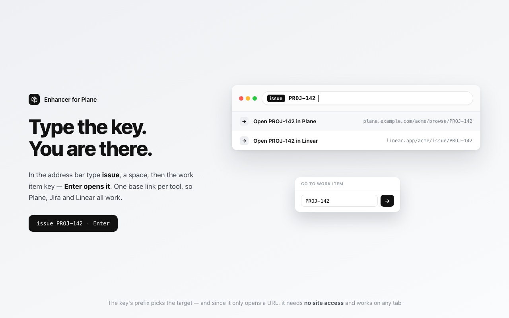
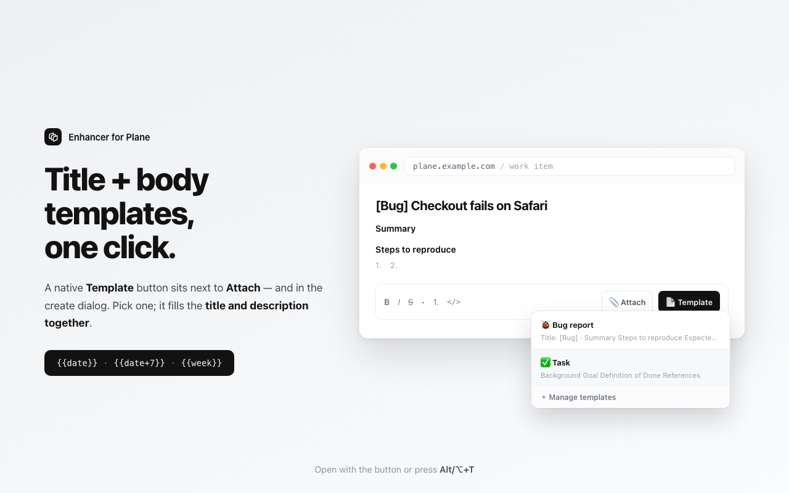
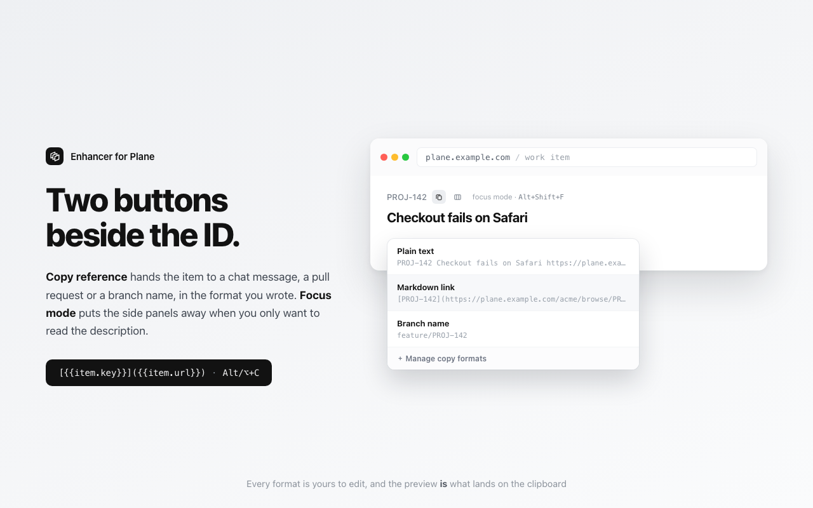
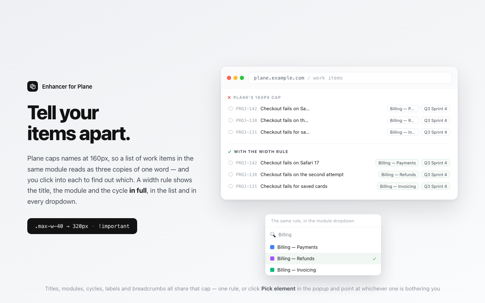
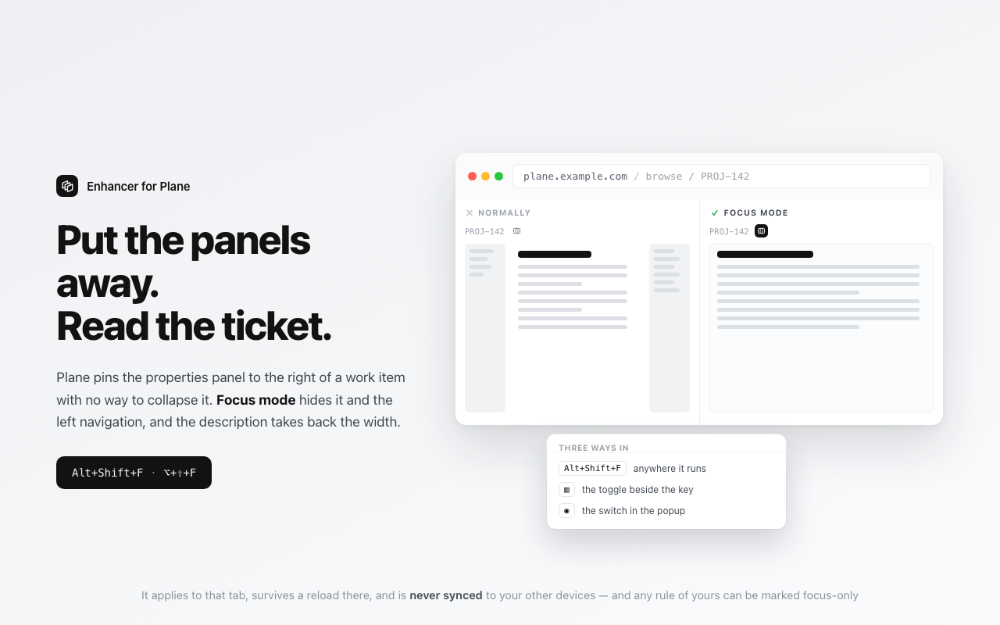

# Enhancer for Plane — 이슈 템플릿 & 바로 열기

[English](README.md) · **한국어**

[](https://chromewebstore.google.com/detail/dicjfphghjfljkifogkplgdeefjdkhbo)
[](https://github.com/gaerae/enhancer-for-plane/releases/latest)

<sup>배지가 둘인 이유는 서로 다른 시점에 움직이기 때문입니다. `main`에 버전을 올리면 GitHub
Release는 1분 안에 만들어지고, 같은 버전이 스토어에 닿으려면 심사를 거쳐 며칠이 걸립니다.
둘이 다른 동안 실제로 설치되어 있는 것은 스토어 쪽입니다.</sup>

**➜ [Chrome 웹 스토어에서 설치](https://chromewebstore.google.com/detail/dicjfphghjfljkifogkplgdeefjdkhbo)** — 또는 [소스에서 직접 로드](#설치).

[Plane](https://github.com/makeplane/plane)(makeplane / plane.so)을 위한 가벼운
비공식 크롬 익스텐션(Manifest V3)입니다. Plane은 프로젝트 관리와 이슈, 위키를
함께 다루는 오픈소스 도구이자 Jira의 자체 호스팅 대안입니다.

어느 이슈 트래커든 비어 있는 곳을 채웁니다 — 반복해 등록하는 티켓에 쓸
**이슈 템플릿**, 키로 티켓에 닿는 **바로 열기**, 클릭 한 번의 **참조 복사**,
측면 패널을 치워 주는 **집중 모드**.

전부 Plane UI 안에서 동작하고, Plane 서버는 전혀 건드리지 않습니다. Plane Cloud와
자체 호스팅 모두에서 되며, 켜 둔 도메인에서만 동작합니다.

> Plane과 제휴하거나 승인받은 제품이 아닙니다. "Plane"은 해당 소유자의 상표이며,
> 본 익스텐션은 독립적인 비공식 애드온입니다. (비행기와는 무관합니다.)



## 무엇을 하고, 어디서 쓰나

| | 어디서 | 먼저 필요한 것 |
|---|---|---|
| **키로 항목 열기** | 주소창 `issue` ␣ `PROJ-123` · 툴바 팝업 · 글 속의 키를 드래그하고 우클릭 | 바로 열기 링크 1개 |
| **최근에 본 것으로 돌아가기** | 같은 두 곳 — 키워드를 입력하는 순간 뜹니다 | 없음, 알아서 쌓입니다 |
| **열지 말고 검색하기** | 주소창 `issue` ␣ `로그인 버그` | 그 링크의 검색 주소 |
| **참조 복사** | 항목 번호 옆 버튼 · <kbd>Alt</kbd>/<kbd>⌥</kbd>+<kbd>C</kbd> · 팝업 | 없음, 형식 3개 기본 제공 |
| **제목 + 본문 넣기** | 설명 툴바의 "Template" 버튼 · <kbd>Alt</kbd>/<kbd>⌥</kbd>+<kbd>T</kbd> | 템플릿 1개 |
| **팀과 템플릿 공유** | 설정 ▸ 템플릿 ▸ 템플릿 동기화 | JSON 주소 1개 |
| **측면 패널 숨기기** | <kbd>Alt</kbd>+<kbd>Shift</kbd>+<kbd>F</kbd> · 번호 옆 토글 · 팝업 | 없음, 프리셋 제공 |
| **잘린 이름 넓히기** | 설정 ▸ 화면 · 또는 팝업의 요소 피커 | 없음, 프리셋 제공 |

**처음 5분**

1. 설치하고 Plane 탭에서 툴바 아이콘 → **이 사이트에서 사용**. Chrome이 그 사이트 하나만
   한 번 물어봅니다. 다른 곳에서는 아무것도 실행되지 않습니다.
2. 설정 ▸ **작업 항목** ▸ **＋ 링크 추가** → 열어 둔 작업 항목의 주소를 붙여넣으세요.
   이 붙여넣기 한 번으로 열기와 검색, 복사가 모두 준비됩니다.
3. 주소창에 `issue`와 한 칸을 입력해 보세요. 이 문서의 나머지는 전부 선택 사항입니다.

무엇을 하기 전까지는 전부 꺼져 있거나 비어 있습니다 — 적용 도메인도, 사이트 접근 권한도,
바로 열기 링크도 없이 배포됩니다.

## 기능

각 기능이 무엇을 하고 어디서 쓰는지만 적었습니다. 구현 메모는
[동작 방식 메모](#동작-방식-메모)에, 그렇게 만든 이유는 [AGENTS.md](AGENTS.md)에 있습니다.

### ⚡ 바로 열기

들어가는 길이 셋입니다. 주소창, 툴바 팝업, 그리고 남의 글 속에 있는 키를 드래그하고 우클릭.

- **주소창.** `issue`를 입력하고 한 칸 띄운 뒤 `PROJ-123` 같은 키를 넣으면 Enter로 열립니다.
  같은 입력칸이 툴바 팝업에도 있습니다.
- **우클릭.** 키는 키의 모습으로 오지 않습니다. Slack 메시지나 PR 제목 속 문장에 섞여 옵니다.
  어디서든 그 부분을 드래그하고 우클릭해 **선택한 텍스트에서 작업 항목 열기**를 고르세요.
  Chrome이 선택한 텍스트만 넘겨주고 페이지는 읽지 않습니다. 아무것도 입력하지 않아도 되는
  유일한 경로입니다.
- **링크 추가는 붙여넣기 한 번입니다.** 열어 둔 작업 항목의 주소를 복사해 설정 ▸ **작업 항목**에
  붙여넣으면, 아는 트래커는 알아보고 검색 주소까지 채웁니다. 열어 둔 것이 없으면 예시 줄에서
  시작하세요. Plane, Jira, Linear, GitHub, GitLab이 준비돼 있습니다.
- **URL 하나를 여는 것뿐이라 어느 트래커에서든 됩니다.** 대상마다 키가 들어갈 자리에 `{{key}}`를
  넣은 기본 링크를 둡니다. Plane은 `/{workspace}/browse/{{key}}`입니다. 호스트 권한도 콘텐츠
  스크립트도 필요 없어 어느 탭에서나 동작합니다. 키의 접두사가 대상을 고르므로 `ENG-`는
  Linear로 보내고 나머지는 Plane에 둘 수 있습니다.
- **최근에 연 키가 다시 나옵니다.** 주소창과 팝업 양쪽에, 12개까지, 기기별로만, 동기화 없이.
- **낱말을 넣으면 검색합니다.** 대상에 `{{q}}`가 든 검색 주소를 넣어 두면 `issue login bug`가
  트래커의 검색으로 갑니다. 다만 어디까지 가는지는 트래커마다 다릅니다. Jira와 GitHub은 결과
  화면까지 데려다주고, Plane은 검색 화면에 낱말을 채워 둔 채 키 입력 한 번을 남겨 둡니다.

### 📝 본문 템플릿(제목 + 본문)

템플릿을 한 번 등록해 두면 어떤 작업 항목에도 클릭 한 번으로 넣습니다. 제목과 설명을 함께
채웁니다. 설명 툴바와 "신규 작업항목 생성" 창에 네이티브 **"Template"** 버튼이 붙고,
`Alt/⌥+T`는 양쪽 모두에서 동작합니다.

- 본문은 **마크다운**입니다. 제목, `-`/`1.` 목록, `- [ ]` 체크박스, 굵게, 인라인 코드.
- **삽입할 때 변수가 채워집니다.** `{{date}}`, `{{date+N}}`/`{{date-N}}`(예: 마감일
  `{{date+7}}`), `{{week}}`, `{{month}}`.
- **직접 만드는 변수 5개까지.** 설정에서 `이름` → `값`을 등록하고 템플릿에 `{{var.이름}}`으로
  씁니다. 공유 템플릿에 `{{var.team}}`을 넣어 두면 삽입하는 사람마다 다른 값으로 채워지고,
  개인 값은 브라우저 밖으로 나가지 않습니다. 등록하지 않은 이름은 지우지 않고 토큰 그대로
  두므로 오타가 조용히 텍스트를 삼키지 않습니다.



### 📋 참조 복사

작업 항목 번호 옆 버튼(또는 `Alt/⌥+C`)이 그 항목을 클립보드로 복사합니다. 메신저, 풀 리퀘스트
본문, 브랜치명으로 넘길 때 제목 드래그와 URL 복사를 따로 하지 않아도 됩니다. 항목 자신의
화면에서도, 목록에서 열리는 패널에서도 동작합니다.

- **형식은 직접 씁니다.** 일반 텍스트, 마크다운 링크, 브랜치명 세 가지가 기본으로 들어 있고
  전부 편집 가능한 줄입니다. 적은 그대로 복사되며, 설정에서 줄마다 결과를 미리 보여 줍니다.
- 치환되는 값은 `{{item.key}}`, `{{item.title}}`, `{{item.url}}` 셋입니다. 페이지에서 읽지
  못한 값은 빈 문자열이 되지 않고 토큰 그대로 남고 토스트가 알려 줍니다. 붙여넣기 전에 알 수
  있습니다.
- **툴바 팝업에서도** 됩니다. 지금 탭이 작업 항목이면 탭의 주소와 제목만 읽어 복사하므로, 바로
  열기에 링크를 등록해 둔 곳이면 어디서든 동작합니다.



### 📐 스타일 규칙 — 범용 엔진

Plane은 목록과 드롭다운에서 긴 이름을 잘라 어느 항목인지 구분하기 어렵게 만듭니다.
`선택자 + 속성 + 값` 규칙 하나로 원하는 폭을 지정하면 이름이 돌아옵니다.

- 값은 단위까지 직접 씁니다. `320px`, `30rem`, `55ch`. 선택자 유효성은 입력하는 동안 검사합니다.
- 항목 이름 폭과 검색 드롭다운 폭 두 개는 켜진 채로 들어 있고, 사이클과 브레드크럼 폭은
  **빠른 추가** 칩으로 한 번에 넣습니다. 범용 엔진이라 Plane이 자르는 다른 것도 같은 방식으로
  규칙 하나면 되고, 버전이 바뀌어 클래스명이 달라져도 선택자만 고치면 됩니다.
- **규칙마다 실제로 일하고 있는지 알려 줍니다.** 아무것도 찾지 못하는 선택자는 오류가 아니라
  무동작입니다. Plane이 개편돼도 확장이 깨지지 않는 이유가 그것인데, 대신 죽은 규칙과 아무도
  안 켠 규칙이 똑같아 보입니다. 그래서 줄마다 마지막으로 적용된 시점을, 한 번도 못 찾았으면
  그렇다고 적습니다. 개편은 오늘 날짜가 늘어선 목록 옆의 오래된 날짜 하나로 드러납니다.



### 🧘 집중 모드

`Alt+Shift+F`(macOS `⌥+⇧+F`)로 측면 패널을 숨기면 설명 본문만 남습니다. 작업 항목 번호 옆
토글과 툴바 팝업 스위치로도 됩니다.

- **스위치가 달린 규칙 엔진입니다.** 어떤 규칙이든 *"집중 모드에서만 적용"*으로 표시하면
  함께 동작합니다. 속성 패널과 왼쪽 내비게이션을 숨기는 프리셋 두 개가 바로 쓸 수 있게 들어
  있고, 읽기 폭을 잡아 주는 세 번째는 꺼진 채로 들어 있습니다.
- **탭 단위이고, 그 탭에서만 유지됩니다.** 새로 고쳐도 남아 있고 탭을 닫으면 사라지며, 기기
  간에 동기화되지 않습니다.
- 단축키는 페이지 키 핸들러가 아니라 **브라우저 명령**이라, 설명을 입력하는 중에도 글자를
  먹지 않고 동작합니다. `chrome://extensions/shortcuts`에서 바꿀 수 있고, 설정 ▸ **단축키**에
  확장이 반응하는 키가 모두 적혀 있습니다.



### 🎯 비주얼 요소 피커

팝업에서 **"요소 선택 → 규칙 추가"**를 누르고 화면의 요소를 클릭하면, 각 선택자가 몇 개와
매칭되는지와 함께 후보 목록이 뜹니다. 고른 것은 값만 넣으면 되는 상태로 설정에 담깁니다.
DevTools가 필요 없습니다.

- **목록 순서는 "얼마나 정확한가"가 아니라 "다음 달에도 살아 있을까" 기준입니다.** 사람이 붙인
  이름이 먼저 오고, 해시 클래스나 uuid처럼 빌드가 만들어낸 것은 아래로 내려갑니다. 내리기만
  하고 숨기지는 않습니다. 남의 마크업에 대한 추측이니까요.
- **그 판단을 줄마다 말로 적습니다.** 어떤 종류의 이름인지, 그리고 **오래감**인지 **곧 바뀜**인지.
- 뒷부분이 생성된 id에는 `[id^="…"]` 접두사 형태도 함께 제안합니다.

### 🔄 팀 템플릿 동기화

JSON 파일 하나를 가리키면(사내 서버, Git 호스트, 아무 URL이나) 팀 전체가 같은 템플릿을 씁니다.
기본은 꺼져 있습니다.

- 설정에서 소스를 추가하면 Chrome이 그 오리진 하나의 접근을 묻고, 템플릿이 소스별 제목 아래
  피커에 나타납니다. **소스가 어떻게 생겼는지 모르겠다면** **"예시 사용해 보기"**를 누르세요.
  이 저장소의 26개 팩을 사용 언어에 맞춰 채워 줍니다.
- **원하는 주기로 갱신됩니다.** 1시간, 6시간, 12시간, 하루에 한 번 중에서 고르고 **↻ 지금 동기화**도
  있습니다. 소스는 10개까지, 각각 주기와 켜기/끄기를 따로 둡니다.
- **동기화된 템플릿은 읽기 전용입니다.** 수정은 소스에서 합니다. 로컬에 남는 것은 보기 설정뿐이라,
  필요 없는 그룹을 숨기면 동기화를 해도 숨긴 채로 남습니다.
- **피커는 캐시만 읽고 네트워크를 쓰지 않습니다.** 삽입에 요청이 들지 않고 오프라인에서도
  동작하며, 동기화가 실패해도 마지막 정상본이 남습니다.
- 원격 데이터는 신뢰하지 않습니다. 크기를 제한하고, 마크업이 아닌 텍스트로만 그리며, id는
  소스별로 분리합니다. [파일 형식](#팀-템플릿-파일-형식)을 참고하세요.

### 🏠 활성 도메인

추가한 도메인에서만 동작합니다. 와일드카드(`*.example.com`)와 "모든 사이트에서 동작" 스위치를
지원합니다.

### 💾 백업(가져오기 / 내보내기)

직접 설정한 것을 JSON 파일로 내보내고 되돌립니다. 도메인과 규칙, 템플릿, 변수, 복사 형식, 바로
열기 링크, 동기화 소스가 담깁니다. 내려받은 템플릿과 동기화 상태는 담기지 않습니다. 다음
동기화가 다시 받아오는 기기별 캐시이기 때문입니다. 가져오면 폼에 로드되고 `Save`로 적용합니다.

## 팀 템플릿 파일 형식

팀이 `http(s)`로 접근할 수 있는 곳이면 어디든 JSON 파일 하나를 두면 됩니다 — 사내 경로,
Git 호스트의 raw URL, S3 버킷. 그 URL을 설정 ▸ 템플릿 ▸ **템플릿 동기화**에 추가합니다.

이 파일을 손으로 쓸 필요는 없습니다. **설정 ▸ 템플릿 ▸ 본문 템플릿 ▸ "팀에 공유"** 를 누르면
지금 가진 템플릿이 아래 형식 그대로 저장됩니다. UI에서 만들고, 저장하고, 올리고,
주소를 공유하면 끝입니다. 저장할 때 모음 이름(`name`)을 묻고 오늘 날짜를 `version`으로
찍습니다. 이것은 백업이 아니라 **배포용 파일**입니다. 내 템플릿만 담기며 도메인과 규칙, 변수 값,
소스 URL은 들어가지 않습니다. 소스에서 *받은* 템플릿도 빠집니다. 그 템플릿은 배포한
쪽에서 관리합니다.

```json
{
  "schema": 1,
  "name": "QA & Delivery standards",
  "version": "2026-07-15b",
  "templates": [
    {
      "id": "bug-detailed",
      "group": "QA Templates",
      "name": "🐞 Bug (detailed)",
      "title": "[Bug] ",
      "content": "## 재현 절차\n1. \n\n## 기대 결과\n\n## 실제 결과\n"
    }
  ]
}
```

| 필드 | 필수 | 의미 |
|---|---|---|
| `name` | 아니요 | 모음의 이름. 설정에서 소스에 직접 이름을 붙이지 않았다면 피커의 헤더로 쓰입니다. |
| `version` | 아니요 | 자유 형식 문자열. 참고용일 뿐입니다 — 아래 설명 참고. |
| `templates[]` | **예** | 중첩이 없는 단순한 배열. `{ "groups": [...] }` 형태는 지원하지 않습니다. 그룹은 항목마다 필드로 넣습니다. |
| `.name` | 예¹ | 피커에 표시되는 이름. |
| `.title` | 아니요 | 미리 채울 작업 항목 제목. |
| `.content` | 아니요 | 본문(마크다운). `{{date}}`, `{{var.team}}` 등은 삽입 시점에 치환됩니다. |
| `.group` | 아니요 | 소스 안의 하위 제목. 비우면(또는 `""`) 소스 헤더 바로 아래, 이름 있는 그룹들보다 위에 놓입니다. |
| `.id` | 아니요 | 고정 id. 생략하면 내용에서 자동 생성되는데, 그러면 항목을 수정할 때마다 "새 항목"이 되어 누군가 걸어둔 그룹 숨김 설정이 풀립니다. 오래 쓸 항목에는 id를 지정하세요. |

¹ `name`/`title`/`content` 중 최소 하나는 채워야 하며, 셋 다 비면 버려집니다.
`name`이 없는 항목은 `(이름 없음)`으로 표시됩니다.

**`version`은 최신 여부를 판정하지 않습니다.** 익스텐션은 받아온 내용을 매번 그대로
저장합니다. 의도한 설계입니다 — 버전으로 캐시를 거르면 누군가 버전 올리기를 한 번만
잊어도 팀 전체가 옛 템플릿을 받게 되고, 이 프로젝트가 실제로 그 버그를
겪었습니다(`count: 11 / stored: 3`). 그래서 그 비교를 걷어냈습니다.

내려받을 때 적용되는 제한: 소스 **10개**, 소스당 템플릿 **200개**, 응답 **512 KB**,
본문 **20,000자**, 이름/제목/그룹 **300자**. 제한을 넘으면 그 부분만 잘리거나 빠지고
파일 전체가 거부되지는 않습니다 — 항목 하나가 크다고 나머지를 잃지 않습니다.
(소스가 디스크를 차지하는 양은 응답 캡이 정하므로, 10 × 512 KB가 저장 예산입니다 —
`chrome.storage.local` 용량의 절반입니다.)

**소스가 리다이렉트한다면 최종 주소를 넣으세요.** 리다이렉트는 따라가지만 템플릿은
승인한 오리진에서만 받습니다. 그래서 다른 호스트로 넘어가는 주소는 동기화되지 않고
`Redirected to <호스트>, which you have not granted`로 알려줍니다. 흔한 경우가 Git
호스트입니다 — `github.com/<org>/<repo>/raw/main/t.json`은 `raw.githubusercontent.com`
으로 넘어가므로, 처음부터 `raw.githubusercontent.com` 주소를 넣으면 됩니다.

그룹 순서는 파일에 처음 나온 순서를 따르고, 그룹 없는 항목이 먼저 옵니다. 실제 예시는
"예시 사용해 보기"가 구독하는 템플릿 26개 모음
[`examples/team-templates.json`](examples/team-templates.json)과 그 한글판
[`examples/team-templates-ko.json`](examples/team-templates-ko.json)에 있습니다.
복사해서 직접 만든 주소로 서비스하고, 팀이 실제로 이슈를 쓰는 방식에 맞게 템플릿을
고쳐 쓰면 됩니다.

## 자체 호스팅 Plane을 위해 만들었고, Plane Cloud에서도 동작합니다

이 익스텐션은 **자체 호스팅 Plane**을 위해 만들었고, 같은 빌드가 **Plane
Cloud**(`app.plane.so`)에서도 동작합니다. 어느 쪽이든 **기본 활성 도메인도, 호스트
접근 권한도 없어**, 사용하는 주소(예: `plane.your-company.com` 또는 `app.plane.so`)를
팝업의 **이 사이트에서 사용** 또는 설정의 활성 도메인에서 추가하기 전까지는 아무
동작도 하지 않습니다. 도메인을 추가하면 Chrome이 그 사이트 하나에 대한 1회성 접근
권한을 묻습니다. 그 외 사이트에서는 완전히 비활성 상태로 남습니다.

둘은 같은 화면을 서로 다른 클래스로 그립니다. 클래스 이름을 직접 적어 둔 프리셋에만
영향이 있는데, 두 번째 형태가 필요했던 프리셋은 이제 전부 양쪽을 담고 있고, 릴리스마다
양쪽 세대의 실제 인스턴스에서 확인합니다. 아무것도 찾지 못하는 규칙은 그냥 아무 일도
하지 않고, 그건 꺼둔 규칙과 구분되지 않기 때문입니다 — 실제로 그 이유로 프리셋 하나가
한 릴리스 내내 깨진 채였습니다. 프리셋이 놓치는 건 셀렉터 한 줄을 고치거나 요소 피커로
한 번 집으면 됩니다. 범용 규칙 엔진이 있는 이유가 이것입니다.

## 설치

**Chrome 웹 스토어에서 설치(권장)**

[Enhancer for Plane 설치](https://chromewebstore.google.com/detail/dicjfphghjfljkifogkplgdeefjdkhbo) →
툴바 아이콘 클릭 후 사용하는 Plane 인스턴스에서 **이 사이트에서 사용**.

**개발자 모드(소스에서)**

1. Chrome에서 `chrome://extensions` 접속.
2. 우측 상단 **개발자 모드** 켜기.
3. **압축해제된 확장 프로그램을 로드** → 이 프로젝트 폴더 선택.
4. 툴바 아이콘 클릭 → **설정 · 템플릿 관리**에서 도메인/폭/템플릿 조정.

## 양쪽 세대에서 실제로 확인한 것

릴리스마다 자체 호스팅 Plane 1.4와 Plane Cloud에서 손으로 직접 확인합니다. 둘은 같은
페이지를 같은 방식으로 그리지 않고, 아무것도 찾지 못하는 규칙은 조용히 아무 일도 하지
않기 때문입니다. 별도 표기가 없으면 2026-08-09 측정입니다.

- `.max-w-40`에 CSS를 주입하면 max-width가 160px에서 지정한 값으로 바뀝니다. Cloud에서는
  작업 항목 목록의 35개와 매칭되고 항목 상세 화면에서는 0개입니다. 건강한 규칙의 정상적인
  모습입니다.
- **템플릿 버튼**이 양쪽 모두 설명 툴바의 첨부 버튼 옆에 붙습니다. 에디터에서 위로 올라가며
  찾는데, Cloud는 그 버튼이 1.4보다 두 단계 밖에 있습니다(10 대 8 이내). 한 릴리스 동안
  Cloud에서 이 버튼이 아예 없었던 이유입니다.
- **참조 복사**가 양쪽 실제 페이지에서 키와 제목, URL을 모두 읽어 냅니다.
- **검색 드롭다운** 프리셋이 1.4의 Headless UI와 Cloud의 Base UI 양쪽에 맞습니다.
  ⌘+K 명령 팔레트와 작업 항목 생성 창은 일부러 잡지 않습니다.
- **집중 모드 프리셋**이 속성 패널과 왼쪽 내비게이션을 숨기고 설명 열이 그 자리를 가져갑니다.
  2026-08-08 Cloud 측정: 본문 열이 1056px에서 1658px로 늘고, 읽기 폭 프리셋이 정확히
  `(1658 − 960) / 2` = 349px 여백으로 가운데 맞춤.

## 사용법 요약

- **키로 열기**: 주소창에 `issue`, 한 칸, 키. 팝업에도 같은 입력칸이 있고, 남의 글 속 키는
  드래그 후 우클릭 → **선택한 텍스트에서 작업 항목 열기**.
- **바로 열기 링크 추가**: 설정 → 작업 항목 → **＋ 링크 추가** → 쓰는 트래커에서 아무
  작업 항목이나 열어 주소를 복사해 붙여넣기. 아는 형태면 검색 주소까지 채워집니다.
- **참조 복사**: 항목 번호 옆 버튼 또는 `Alt/⌥+C`. 지금 탭이 작업 항목이면 팝업에서도 됩니다.
- **템플릿 삽입**: 작업 항목 설명에서 **"Template" 버튼** 또는 `Alt/⌥+T` → 템플릿
  선택 → 제목·본문 자동 채움(마크다운 렌더).
- **폭 조정**: 설정 → 화면 → 스타일 규칙에서 규칙 추가(또는 피커로 요소 지정) → 값 입력 →
  Save. 지정 도메인 새로고침 시 적용.
- **본문에 집중**: `Alt+Shift+F`(macOS `⌥+⇧+F`), 작업 항목 번호 옆 토글, 또는 팝업의 집중 모드
  스위치 → 속성 패널과 왼쪽 내비게이션이 숨습니다. 같은 방법으로 되돌아오고, 그 탭에서만
  유지됩니다.
- **단축키 한눈에 보기**: 설정 ▸ 단축키.
- **버튼이 안 보일 때**: 설명 에디터를 클릭하면 자동 재주입되고, 안 되면 팝업의
  **↻ 이 페이지 다시 검사**로 강제 재주입합니다.
- **팀 템플릿 공유**: 설정 → 템플릿 → **템플릿 동기화**를 켜고 JSON 파일 URL을 추가(Chrome이
  그 사이트 접근을 물으면 허용) → **↻ 지금 동기화**. 이후 선택한 주기로 자동 갱신됩니다.

## 제약조건

- **Chrome / Chromium, Manifest V3** — Firefox·Safari용 아님.
- **Plane 전용, 기본 비활성** — 자체 호스팅과 Plane Cloud 모두에서 동작하지만, 활성
  도메인이 기본으로 없으며 팝업이나 설정에서 직접 추가해야 합니다. Plane 외 사이트는
  건드리지 않습니다.
- **동기화 저장소 한계(전체 ~100 KB, 항목당 ~8 KB).** 둘 다 Chrome이 정한 값이고 올릴 수
  없습니다. 예전에는 설정 전체가 항목 하나였기 때문에 8 KB가 곧 전체 한도였고, 지금은
  템플릿이 별도 항목(`peTpl.0`, `peTpl.1`, …)에 나뉘어 담기므로 한도가 전체 100 KB입니다.

  용량은 글자 수가 아니라 **바이트**로 셉니다. 한글은 글자당 3바이트, 이모지는 4바이트,
  `<`는 Chrome이 이스케이프해서 저장하므로 6바이트입니다. 그래서 정직한 답은 하나의
  숫자가 아니라 범위이며, 아래는 추정이 아니라 실측값입니다.

  | | 100 KB에 들어가는 개수 | 템플릿 1개 최대 길이 |
  |---|---|---|
  | 영문 400자 | 약 218개 | 약 8,100자 |
  | 한글 400자 | 약 81개 | 약 2,700자 |
  | HTML 섞인 마크다운 | 약 160개 | 약 1,350자 |

  **템플릿 하나는 여전히 8 KB 항목 하나에 들어가야 합니다** — 더 쪼갤 수 없습니다. 두
  한도 중 어느 쪽이든 넘기면 저장은 미리 거부되며, 어느 템플릿 또는 어느 설정이 원인인지
  알려줍니다. 설정 페이지 미터는 두 한도를 모두 봅니다. **팀 템플릿은 이 한도를 전혀 쓰지
  않습니다** — `chrome.storage.local`(10 MB, Chrome 113 이하는 5 MB, 이 기기 전용)에
  저장되며, 공유 템플릿을 많이 두려면 동기화가 답인 이유가 이것입니다.
- **동기화된 템플릿은 읽기 전용.** 수정은 설정이 아니라 원본 파일에서 합니다. 여기서
  고쳐봐야 다음 동기화가 조용히 되돌리므로 아예 수정 수단을 두지 않았습니다. 그룹
  숨기기는 로컬 설정이라 유지됩니다.
- **마크다운 렌더링은 에디터에 의존** — 본문을 HTML로 paste해 제목/목록/체크박스를
  렌더하며, 특정 빌드가 paste를 거부하면 리터럴 텍스트로 대체됩니다.
- **설명 템플릿만 지원** — 댓글 템플릿은 제공하지 않습니다.
- **규칙 값은 sanitize** — 값에서 `;{}` 제거, 속성명은 화이트리스트, 선택자는 파싱
  검증 후 주입.
- **브랜드.** 팝업과 설정은 Plane의 모노크롬 톤(니어블랙 `#121212` + 화이트)과
  시스템의 라이트·다크 테마를 따릅니다. 확장의 화면이 겉붙은 것처럼 보이지 않게.

## 권한

- `storage` — 사용자 설정(도메인과 규칙, 템플릿, 변수, 복사 형식, 동기화 소스)을 저장하고, 내려받은
  팀 템플릿을 이 기기에 캐시합니다.
- `alarms` — 선택한 주기에 서비스 워커를 깨워 팀 템플릿을 갱신합니다. MV3 워커는 유휴
  상태에서 종료되므로 `setTimeout`은 아예 실행되지 않습니다. 주기 동기화를 하려면 이
  방법뿐입니다. 설치 시 Chrome이 이 권한으로 경고를 띄우지 않습니다.
- `contextMenus` — 텍스트를 선택했을 때만 나타나는 우클릭 메뉴 항목 하나를 추가합니다. 선택한
  글에서 작업 항목 키를 찾아 엽니다. Chrome이 선택한 텍스트를 넘겨줄 뿐이고 페이지 자체는 읽지
  않으며, 다른 상황에서는 메뉴에 나타나지 않습니다.
- `activeTab` — 툴바 아이콘 클릭 시, 팝업이 현재 탭의 호스트명을 읽어 상태 표시 및
  "이 사이트에서 사용"을 제공하고, 요소 피커 시작 메시지를 현재 탭에 보냅니다. 사용자가
  익스텐션을 실행한 그 탭에 한정됩니다.
- `scripting` — 사용자가 승인한 특정 오리진에만 콘텐츠 스크립트를 등록/주입합니다.
- **선택적 호스트 권한, 사이트별 요청.** 설치 시 **호스트 접근 권한이 전혀 없습니다.**
  도메인을 활성화할 때(팝업 또는 설정) 그 **오리진 하나만** 접근을 요청하고, Chrome이
  사이트명을 명시한 권한 프롬프트를 띄웁니다. 모든 사이트 접근을 미리 요구하지 않으며,
  승인한 도메인에 대해서만 접근을 보유하고, 도메인을 제거하면 접근도 해제됩니다. (자체
  호스팅 Plane 호스트는 빌드 시점에 알 수 없어 고정 목록이 불가능하므로, 이 사이트별
  승인이 임의 호스트를 지원하는 최소 권한 방식입니다.) 팀 템플릿 소스 URL도 같은 방식으로
  승인받습니다 — 소스를 추가할 때 해당 오리진을 묻고, 승인하지 않은 오리진은 워커가
  요청 자체를 거부합니다.

계정도, 추적도, 분석도, 원격 코드도 없습니다. 개발자는 서버를 운영하지 않으며 사용자로부터
아무것도 받지 않습니다. 익스텐션이 보내는 유일한 요청은 사용자가 직접 등록한 URL에서
팀 템플릿 파일을 내려받는 것이고, 그 요청에는 사용자의 데이터가 담기지 않습니다.
자세한 내용은 [PRIVACY.md](PRIVACY.md) 참고.

## 동작 방식 메모

- **승인 전에는 호스트 접근이 없습니다.** 정적 콘텐츠 스크립트가 없습니다. 도메인을
  활성화하면 그 오리진에 접근을 요청하고, 서비스 워커가 `chrome.scripting`으로 해당
  오리진에 콘텐츠 스크립트·CSS를 등록합니다(이미 열린 탭엔 즉시 주입해 새로고침 불필요).
  등록은 재시작에도 유지되며 권한·설정 변경 시마다 재조정되고, 도메인을 제거하면 접근도
  해제됩니다.
- **동기화는 워커와 캐시 구조입니다. 실시간 요청이 아닙니다.** `chrome.alarms`가 서비스
  워커를 깨우면(MV3 워커는 유휴 시 종료되므로 타이머는 실행되지 않습니다) 주기가 된
  소스만 받아와 검증과 제한을 거쳐 `chrome.storage.local`에 씁니다. 피커와 팝업, 설정은
  모두 이 캐시만 읽습니다. 그래서 템플릿 삽입에 요청이 없고 오프라인에서도 동작하며,
  소스가 죽었거나 형식이 깨져도 마지막 정상본이 그대로 남고 오류는 설정에 표시됩니다.
  소스를 지우면 캐시된 템플릿도 즉시 사라집니다.
- **스타일은 `adoptedStyleSheets`로 주입**합니다. Plane은 Next.js/React SPA라
  `<head>`/`<body>`에 `<style>` 노드를 넣으면 hydration 과정에서 제거될 수 있어,
  DOM 트리에 잡히지 않는 `adoptedStyleSheets`를 사용합니다.
- **언어 독립 앵커.** 템플릿 버튼·제목 채우기는 UI 텍스트에 의존하지 않습니다. 툴바
  앵커는 구조적으로 찾고(Attach 버튼이 숨은 `input[type="file"]`을 감쌈 — 모든 언어에서
  동일), 제목은 안정적인 `#title-input` id로 매칭합니다. 따라서 어떤 UI 언어의
  Plane에서도 동작하며, `attach`/`첨부` 텍스트는 fallback으로만 둡니다.
- **자가 복구 주입.** 툴바가 늦게 마운트돼 버튼이 안 보여도 새로고침 없이 복구됩니다 —
  설명 에디터에 포커스(또는 `Alt/⌥+T`) 시 재스캔, 팝업의 **↻ 이 페이지 다시 검사**로 강제
  재주입. 콘텐츠 스크립트가 아예 로드되지 않았으면(이 도메인을 활성화하기 전부터 열린 탭 등)
  다시 검사가 이를 알려 새로고침을 안내합니다.

## 검증

의존성도 빌드 단계도 없습니다. 기본 node로 실행합니다:

```sh
node tools/test.js          # 동작: 동기화 엔진, 정규화, 섹션 구성, 개수
node tools/check-i18n.js    # 번역 계약(CI에서는 --strict)
node tools/check-source.js  # 아키텍처 불변식
node tools/dom-harness.js   # 설정 화면과 팝업, 콘텐츠 스크립트를 실제 브라우저에서 구동
```

CI가 모든 푸시와 PR에서 넷 다 돌립니다. `check-source.js`는 리뷰어가 기억해야 했을
규칙을 대신 강제합니다 — 네트워크는 워커 안에서만, 우리가 쓰지 않은 데이터는
`innerHTML`에 넣지 않기, 원격 필드는 전부 제한 적용, 밝은 배경마다 다크 모드 대응색이
있는지, 그리고 릴리스 zip에 실제 로드되는 파일이 빠지지 않았는지. `dom-harness.js`는
실제 레이아웃 엔진에서만 참인 것을 확인합니다 — 어느 탭이 보이는지, 미저장 편집이 탭
전환을 넘어 남는지, 라벨이 무엇이라고 읽히는지, 색이 뒤 배경에 대해 어떻게 해석되는지,
집중 모드가 겨냥한 패널을 정말로 숨기는지 — `chrome` API를 대체한 스텁과 함께 헤드리스
Chrome으로 페이지를 띄워서 봅니다(콘텐츠 스크립트에는 배포되는 규칙이 겨냥하는 클래스를
그대로 지닌 합성 작업 항목 페이지를 줍니다). 브라우저가
필요하며(`PE_CHROME=경로`로 지정), 없으면 로컬에서는 건너뛴 사실을 분명히 알리고 CI에서는
실패로 처리합니다. 조용한 통과보다 실패가 낫습니다. 기여 규칙은 [AGENTS.md](AGENTS.md)에
있습니다.

## 배포

스토어 등록 문구(영/한), 권한 정당화, 자산 체크리스트는
[store-assets/STORE_LISTING.md](store-assets/STORE_LISTING.md)에 있습니다. 스크린샷과
프로모 타일은 `store-assets/`에 있습니다.

**릴리스는 `manifest.json`의 버전에서 자동 생성** — 손으로 태그하지 않습니다.
워크플로 [.github/workflows/release.yml](.github/workflows/release.yml)이 버전을 읽어
배포 파일만 패키징하고 Release를 게시합니다.

새 버전 배포:

1. `manifest.json`의 `"version"`을 올림(예: `1.1.0` → `1.1.1`).
2. 커밋 후 `main`에 푸시.
3. CI가 `v<버전>` 태그와 `enhancer-for-plane-<버전>.zip`이 첨부된 GitHub Release를
   생성합니다(이미 릴리스된 버전이면 건너뜀).

이후 Release에서 zip을 내려받아 Chrome 웹스토어 대시보드에 업로드합니다.

## 라이선스

[MIT](LICENSE) © 2026 gaerae
