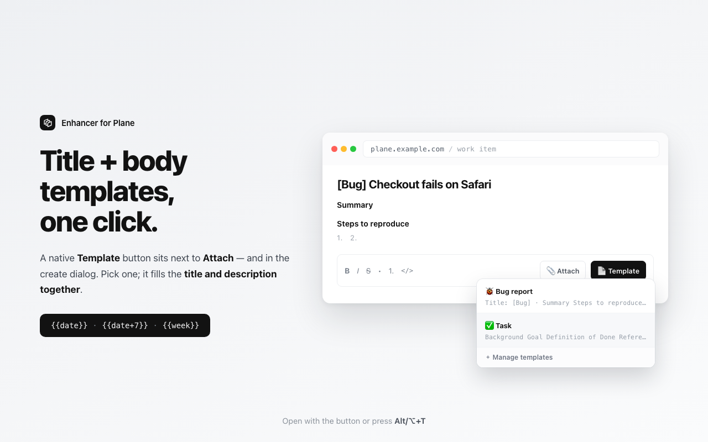

# Enhancer for Plane — Projects, Wiki & Issues

**English** · [한국어](README.ko.md)

[](https://chromewebstore.google.com/detail/dicjfphghjfljkifogkplgdeefjdkhbo)

**➜ [Install from the Chrome Web Store](https://chromewebstore.google.com/detail/dicjfphghjfljkifogkplgdeefjdkhbo)** — or [load unpacked from source](#install).

A lightweight, unofficial Chrome extension (Manifest V3) for
[Plane](https://github.com/makeplane/plane) (makeplane / plane.so) — the
open-source **project management, issues & wiki** tool and a self-hosted
alternative to Jira. It fixes small day-to-day annoyances directly in the Plane
UI, with **no changes to your Plane server**, applied only on the domains you
enable.

> Not affiliated with or endorsed by Plane. "Plane" is a trademark of its owner.
> (And no — nothing to do with airplanes.)

Brand: follows Plane's monochrome tone (near-black `#121212` + white).



## Features

1. **Body templates (title + body)** — register reusable templates and insert
   them in one click. The biggest gain over stock Plane.
   - A native **"Template" button is added right next to "Attach"** in the
     description toolbar (last item in the row, equal spacing, document icon).
   - Works in the **"Create work item" modal** too — that editor has no toolbar,
     so the "Template" button appears in the modal header, next to the project
     selector (an item-level spot, since a template fills title + body).
     `Alt/⌥+T` works in both places.
   - Selecting one fills the **work-item title** (`#title-input` textarea in the
     detail view, or the modal's `#name` title input) and the **body**
     (ProseMirror) together. The title is optional.
   - Template bodies are **Markdown, rendered into the editor** — `##` headings,
     `-`/`1.` lists, `- [ ]` checkboxes, `**bold**`, `` `code` ``. Because Plane's
     editor is WYSIWYG, the markdown is converted to HTML and inserted via a
     synthetic paste (ProseMirror parses it into real nodes); if the editor
     doesn't accept it, it falls back to literal text.
   - Even when Plane re-renders the toolbar, a `MutationObserver` (plus a short
     bootstrap poll) re-inserts the button. The button is cloned from Attach so
     it always looks native. (Comment templates are not provided.)
2. **Template variables** — substituted on insert: `{{date}}` (today,
   `YYYY-MM-DD`), `{{date+N}}` / `{{date-N}}` (N days from today, e.g.
   `{{date+7}}` for a deadline), `{{week}}` (this week's range,
   `YYYY-MM-DD ~ YYYY-MM-DD`, Monday–Sunday), and `{{month}}` (`YYYY-MM`). Open
   the template menu while editing a description with `Alt/⌥+T`.
   On macOS, Option+T changes `e.key` to a special
   character, so the shortcut is detected via `e.code === "KeyT"`.
   - **Your own variables (up to 5)** — define `name` → `value` pairs in Settings
     and use them as `{{var.name}}`, e.g. `{{var.team}}` → `Platform`. The `var.`
     prefix is what keeps them from ever colliding with a built-in: a future
     `{{quarter}}` can be added without breaking anyone's `{{var.quarter}}`.
     Unknown names are left untouched rather than blanked, so a typo is visible
     instead of silently eating text. This pairs with sync — a shared template can
     say `{{var.team}}` and resolve differently for each person who inserts it,
     with no per-user data ever leaving the browser.
3. **Team template sync** — point the extension at a JSON file (your intranet, a
   Git host, any URL) and everyone pulls the same templates. Off by default.
   - Add a source in Settings → Chrome asks for access to that one origin →
     templates appear in the picker under a header for that source.
   - **Refreshed on a schedule you pick** (hourly / 6h / 12h / daily, via
     `chrome.alarms`), plus **Sync now**. Up to **10 sources**, each fetched
     independently with its own interval and on/off switch.
   - **Synced templates are read-only** — they're edited at the source, not here.
     What is local is the *view*: hide any group you don't need (per source), and
     it stays hidden across syncs without touching the file.
   - **The picker reads the cache, never the network.** Inserting a template costs
     no request and works offline. A failed sync keeps the last good copy.
   - **Remote data is treated as untrusted**: size-capped, rendered as text only
     (never markup), ids namespaced per source so they can't collide with your own.
   - See [the file format](#team-template-file-format) and `examples/`.
4. **Style rules (width / length) — a generic engine**
   - Freely add / edit / delete `selector + property + value` rules. Each rule is
     injected as `selector { property: value !important; }`.
   - Type the full value with units, e.g. `320px`, `30rem`, `55ch`. Selector
     validity is checked live.
   - Built-in default: module / item name width `.max-w-40` → 320px. "Quick add"
     chips seed two more in one click: the module search dropdown, and the
     cycle / breadcrumb name width (`.max-w-[150px].truncate` → 320px).
   - The same truncation isn't module-only. Plane reuses one Tailwind
     "max-width + `truncate`" pattern across **modules, cycles, labels, and the
     breadcrumb path**, just with different caps (`max-w-40` / `max-w-48` /
     `max-w-[150px]`). Because it's a generic engine, you widen any of them the
     same way — add a rule (or use the picker, which escapes bracketed classes
     like `max-w-[150px]` for you). If class names shift between versions, you
     only edit the selector.
5. **Visual element picker** — click **"Pick element → add rule"** in the popup,
   then click any element on the Plane page. A **candidate selector list**
   appears (individual classes / full / id, each with a match count, width
   classes ranked first) so you can choose the right one. The picked rule is
   added to Settings (with an empty value → set the value there and apply). Build
   width/style rules without DevTools.
   - When the picker adds a rule, an open Settings page reflects it
     automatically (via `chrome.storage.onChanged`, unless you have unsaved
     edits).
   - During picking, press events are suppressed with `stopPropagation` only
     (not `preventDefault`, which would cancel the click and break the picker).
6. **Active domains** — runs only on the domains you specify. Wildcards
   (`*.example.com`) and a "run on all sites" switch are supported.
7. **Backup (Import / Export)** — export your settings to a JSON file from the
   "Backup" section, and import them back. It carries everything you configured:
   domains, rules, templates, variables, and sync sources (URLs, intervals, hidden
   groups). It does **not** carry downloaded templates or sync status — those are a
   per-device cache that the next sync refetches, so a backup stays a backup of
   your settings rather than a snapshot of someone else's file. Imported settings
   load into the form — review, then `Save` to apply.

## Team template file format

Host a JSON file anywhere your team can reach over `http(s)` — an intranet path, a
Git host's raw URL, an S3 bucket. Add its URL in Settings ▸ Team template sync.

You do not have to write it by hand. **Settings ▸ Body templates ▸ "Share with your
team"** writes this exact format from the templates you already have: build them in
the UI, export, upload, share the URL. It asks for the collection's `name` and
stamps today's date as `version`. It is a *publication*, not a backup — it carries
your templates and nothing else, no domains, no rules, no variable values, no source
URLs. Templates you received *from* a source are left out too; they belong to
whoever publishes them.

```json
{
  "schema": 1,
  "name": "QA & Delivery standards",
  "version": "2026-07-15b",
  "templates": [
    {
      "id": "bug-detailed",
      "group": "QA Templates",
      "name": "🐞 Bug (detailed)",
      "title": "[Bug] ",
      "content": "## Steps to reproduce\n1. \n\n## Expected\n\n## Actual\n"
    }
  ]
}
```

| Field | Required | Meaning |
|---|---|---|
| `name` | no | The collection's label. Shown as the picker's header for this source unless you give the source your own name in Settings. |
| `version` | no | Free-form string. Informational only — see the note below. |
| `templates[]` | **yes** | A flat array. `{ "groups": [...] }` is *not* the shape; grouping is a field on each item. |
| `.name` | yes¹ | What the picker lists. |
| `.title` | no | Prefilled work-item title. |
| `.content` | no | Body, in Markdown. `{{date}}`, `{{var.team}}` etc. resolve on insert. |
| `.group` | no | Sub-heading within this source. Omit (or `""`) and the item sits directly under the source header, above any named group. |
| `.id` | no | Stable id. Omit it and one is derived from the content — but then editing an item makes it a "new" item, which loses the group-hidden preference someone set on it. Set ids for anything long-lived. |

¹ At least one of `name` / `title` / `content` must be non-empty; entries with all
three blank are dropped. An item with no `name` lists as `(untitled)`.

**`version` does not control freshness.** The extension stores whatever it fetched,
every time. That is deliberate: a version-gated cache means one forgotten bump
serves stale templates to the whole team, and this project shipped exactly that bug
once (`count: 11 / stored: 3`) before the check was removed.

Limits, enforced on download: **10 sources**, **200 templates** per source, **512 KB**
per response, **20,000 chars** per body, **300 chars** per name/title/group. Anything
over a cap is clamped or dropped, not rejected wholesale — one oversized entry never
costs you the rest of the file. (The response cap is what bounds a source on disk, so
10 × 512 KB is the storage budget — half of what `chrome.storage.local` holds.)

**If your source redirects, use the address it lands on.** Redirects are followed, but
templates are only accepted from an origin you granted — so a URL that hops to another
host reports `Redirected to <host>, which you have not granted` rather than syncing.
The common case is a Git host: `github.com/<org>/<repo>/raw/main/t.json` redirects to
`raw.githubusercontent.com`, so enter the `raw.githubusercontent.com` URL directly.

Group ordering follows first appearance in the file; ungrouped items come first.
Working examples: [`examples/team-templates.json`](examples/team-templates.json) and
[`examples/team-templates-design.json`](examples/team-templates-design.json).

## Built for self-hosted Plane

This extension targets **self-hosted Plane**. It ships with **no active domain and
no host access**, so it does nothing until you add your instance (e.g.
`plane.your-company.com`) via the popup's **Enable on this site** or the
active-domains list in Settings — enabling a domain prompts Chrome for one-time
access to that one site. It stays completely inert on every other site.

## Install

**From the Chrome Web Store (recommended)**

[Install Enhancer for Plane](https://chromewebstore.google.com/detail/dicjfphghjfljkifogkplgdeefjdkhbo),
then click the toolbar icon and **Enable on this site** on your Plane instance.

**Developer mode (from source)**

1. Open `chrome://extensions` in Chrome.
2. Turn on **Developer mode** (top right).
3. **Load unpacked** → select this project folder.
4. Click the toolbar icon → **Settings · Manage templates** to adjust domains,
   widths, and templates.

## Verified live (self-hosted Plane instance)

- Injecting CSS on `.max-w-40` changes max-width from 160px to the configured
  value — confirmed applied.
- Values are inserted into React-controlled search inputs via a native setter +
  `input` event — confirmed.
- The description editor is TipTap/ProseMirror (contenteditable) — confirmed, so
  template bodies are inserted as HTML via a synthetic paste (headings, lists, and
  checkboxes render as real nodes), with an `execCommand` text fallback.
- A single page mixes several width classes — confirmed, hence the generic rule
  engine.

## Structure

| File | Role |
|------|------|
| `manifest.json` | MV3 manifest |
| `common.js` | Settings defaults / storage / domain matching / sync cache + normalization / i18n runtime (shared by the worker, content script, and pages) |
| `content.js` / `content.css` | Style-rule injection + template insertion UI + picker |
| `background.js` | Service worker: registers the content script on granted origins and reconciles on permission/settings changes; opens the options page. **The only file that may touch the network** — it fetches team templates on an alarm and caches them |
| `options.html/js/css` | Full settings page |
| `popup.html/js/css` | Toolbar popup (quick toggle · status · picker · re-scan) |
| `_locales/` | `en` + `ko` message catalogues |
| `tools/` | Checks (not shipped) — see below |
| `examples/` | Sample team-template files (not shipped) |

## Checks

No dependencies, no build step — stock node:

```sh
node tools/test.js          # behaviour: sync engine, normalization, sections, counts
node tools/check-i18n.js    # translation contract (--strict in CI)
node tools/check-source.js  # architectural invariants
```

CI runs all three on every push and PR. `check-source.js` enforces what a reviewer
would otherwise have to remember — network access confined to the worker, no
`innerHTML` for data that isn't ours, every remote field clamped, and that the
release zip actually contains every file the extension loads. Contributor rules
live in [AGENTS.md](AGENTS.md).

## How it works (notes)

- **No host access until you grant it.** There are no static content scripts.
  When you enable a domain, the extension requests that origin, and the service
  worker registers the content script + CSS for it via `chrome.scripting`
  (injecting any already-open matching tab so no reload is needed). Registration
  persists across restarts and is reconciled whenever permissions or settings
  change; removing a domain drops its access.
- **Sync is a worker + cache, not a live fetch.** `chrome.alarms` wakes the service
  worker (an MV3 worker is evicted when idle, so a timer would never fire), which
  fetches each due source, validates and clamps it, and writes it to
  `chrome.storage.local`. Everything else — picker, popup, settings — reads that
  cache. So inserting a template makes no request, works offline, and a source that
  is down or malformed leaves the last good copy in place with the error shown in
  Settings. Removing a source drops its cached templates immediately.
- **Styles are injected via `adoptedStyleSheets` (constructed stylesheets).**
  Plane is a Next.js/React SPA — inserting a `<style>` DOM node into
  `<head>`/`<body>` can trigger a hydration mismatch and get the node removed, so
  the rules disappear. `adoptedStyleSheets` are not part of the DOM tree, so they
  don't affect hydration and aren't removed. (Legacy fallback: a `<style>`
  directly under `<html>` re-inserted by a MutationObserver.)
- Rules are applied as user-specified `selector { property: value !important }`.
  Values have `;{}` stripped, property names pass a whitelist regex, and
  selectors are parse-validated.
- Settings are stored in `chrome.storage.sync` and applied live to open tabs on
  change. The content script's full-document observer is only connected on
  domains you've enabled — it stays disconnected everywhere else.
- **Language-independent anchoring.** The template button and title fill don't
  rely on UI text. The toolbar anchor is found structurally (the attach button
  wraps a hidden `input[type="file"]`, the same in every language) and the title
  is matched by its stable `#title-input` id — so it works on Plane in any UI
  language. Attach/첨부 text is kept only as a fallback.
- **Self-healing injection.** If Plane mounts the toolbar late and the button
  doesn't appear, it recovers without a reload: focusing the description editor
  (or pressing Alt/⌥+T) re-scans, and the popup's **↻ Re-scan this page** forces a
  fresh injection. If the content script never loaded at all (e.g. a tab opened
  before you enabled this domain), Re-scan reports it so you can reload.

## Permissions

- `storage` — persists your own settings (domains, rules, templates, variables,
  sync sources) and caches downloaded team templates on this device.
- `alarms` — wakes the service worker on your chosen interval to refresh team
  templates. An MV3 worker is evicted when idle, so a `setTimeout` would never
  fire; this is the only way to sync on a schedule. Chrome shows no install
  warning for it.
- `activeTab` — when you click the toolbar icon, the popup reads the current
  tab's hostname to show status and offer "Enable on this site," and messages the
  tab to start the element picker. Limited to the tab you invoked it on.
- `scripting` — registers/injects the content script on the specific origins you
  grant (see below).
- **Optional host permissions, requested per site.** The extension ships with
  **no host access at all**. When you enable a domain (popup or Settings), it asks
  Chrome for access to *that origin only* — you see a permission prompt naming the
  site. It never requests all-sites access up front, holds access only for the
  domains you granted, and drops that access when you remove a domain. (A
  self-hosted Plane host isn't known at build time, so it can't be a fixed match
  list — this per-site grant is the least-privilege way to support any host.)
  A team-template source URL is granted the same way: adding one prompts for that
  origin, and the worker refuses to fetch a source whose origin you haven't granted.

No accounts, no tracking, no analytics, no remote code. The developer runs no
server and receives nothing from you; the only request the extension can make is
downloading the team-template file from a URL you configured yourself, and it
carries none of your data. See [PRIVACY.md](PRIVACY.md).

## Limits & constraints

- **Chrome / Chromium, Manifest V3** — not built for Firefox or Safari.
- **Self-hosted Plane, inactive by default** — no domain ships enabled; add yours
  in the popup or Settings. It never touches non-Plane sites.
- **Sync storage cap (~100 KB total, ~8 KB per item).** Both numbers are Chrome's
  and neither can be raised. Settings used to occupy a single item, so the 8 KB was
  the ceiling for everything; templates are now packed into their own items
  (`peTpl.0`, `peTpl.1`, …) and the ceiling is the 100 KB.

  Capacity is measured in **bytes**, not characters — a Korean character costs 3,
  an emoji 4, and `<` costs 6 because Chrome stores it escaped. So the honest answer
  is a range, measured rather than estimated:

  | | fits in 100 KB | longest single template |
  |---|---|---|
  | English, ~400 chars each | ~218 | ~8,100 chars |
  | Korean, ~400 chars each | ~81 | ~2,700 chars |
  | Markdown with inline HTML | ~160 | ~1,350 chars |

  **One template must still fit one 8 KB item** — nothing can split it further — and
  a save that breaks either ceiling is refused up front, naming the template or the
  setting responsible. The Settings page meters both. **Team templates don't count
  against any of this**: they live in `chrome.storage.local` (10 MB, 5 MB on
  Chrome ≤ 113; this device only), which is why sync is the way to carry a large
  shared library.
- **Synced templates are read-only.** They're edited at the source file, not in
  Settings. An edit here would be silently reverted by the next sync, so the UI
  doesn't offer one; hiding a group is local and does survive.
- **Markdown rendering depends on the editor** — template bodies are pasted as HTML
  so Plane renders headings/lists/checkboxes; if a build rejects the paste, it
  falls back to literal text.
- **Description templates only** — comment templates are not provided.
- **Rule values are sanitized** — values strip `;{}`, property names pass a
  whitelist, and selectors are parse-validated before injection.

## Publishing

Store listing copy (EN + KO), permission justifications, and the assets
checklist live in [store-assets/STORE_LISTING.md](store-assets/STORE_LISTING.md).
Screenshots and the promo tile are in `store-assets/`.

**Releases are cut automatically from the version in `manifest.json` — you never
tag by hand.** The workflow
[.github/workflows/release.yml](.github/workflows/release.yml) reads the version,
packages only the shipping files (store assets, docs, and `icons/icon.svg` source
are excluded), and publishes the Release.

To ship a new version:

1. Bump `"version"` in `manifest.json` (e.g. `1.1.0` → `1.1.1`).
2. Commit and push to `main`.
3. CI creates the `v<version>` tag and a GitHub Release with
   `enhancer-for-plane-<version>.zip` attached. If that version was already
   released, it skips — so an unrelated push never makes a duplicate.

You can also trigger it from **Actions ▸ Release extension ▸ Run workflow**.
Then download the zip from the Release and upload it in the Chrome Web Store
dashboard.

> If the release step fails with a 403, enable **Settings ▸ Actions ▸ General ▸
> Workflow permissions ▸ Read and write permissions** so the workflow can create
> tags and releases.

<details>
<summary>Build the zip locally instead (optional)</summary>

```sh
zip -r "enhancer-for-plane-$(jq -r .version manifest.json).zip" \
  manifest.json common.js content.js content.css background.js \
  options.html options.js options.css popup.html popup.js popup.css icons _locales \
  -x "icons/icon.svg"
```
</details>

## License

[MIT](LICENSE) © 2026 gaerae
